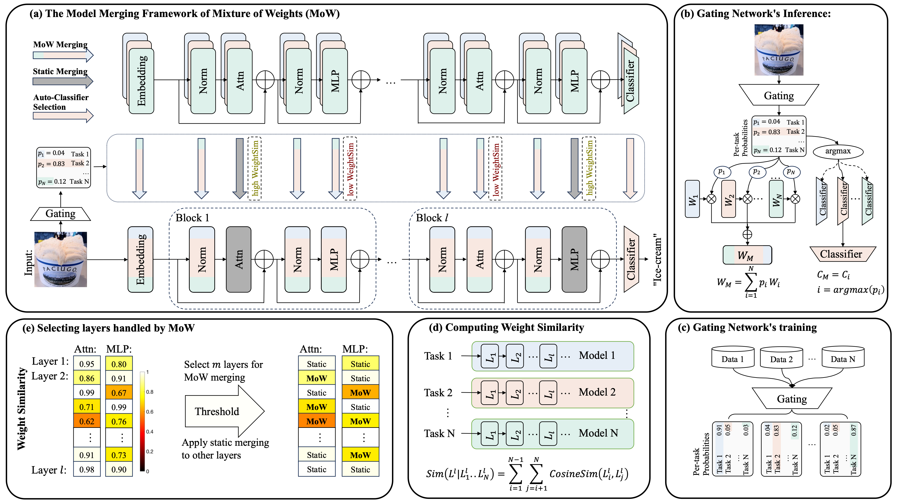

# Mixture of Weights

This is the official implementation of our [TCSVT paper](https://doi.org/10.1109/TCSVT.2025.3544680): Dynamic Model Merging with Mixture of Weights.

We realize controllable and dynamic model merging.



## Get Started

### Dependencies

Please follow [task_vectors](https://github.com/mlfoundations/task_vectors) to install the dependencies.

Additionally, install transformers:

> pip install transformers

### Checkpoints 

You can download the fine-tuned checkpoints from the [task_vectors#checkpoints](https://github.com/mlfoundations/task_vectors#checkpoints).
The Google Drive folder is: [task_vectors_checkpoints](https://drive.google.com/drive/folders/1u_Tva6x0p6oxu5Eo0ZZsf-520Cc_3MKw)

Please follow [doc](./checkpoints/README.md) to place these checkpoints.

### Datasets

Please follow [Adamerging](https://github.com/EnnengYang/AdaMerging?tab=readme-ov-file#datasets) to download the datasets.

Please follow [doc](./data/README.md) to place these datasets.


## Eval

Run AdaMerging++ (Layerwise) w/ MoW-Merging
> python src/main_mow_merge.py


## Results

Results will be saved in ./logs. 

# Citation
```bibtex
@ARTICLE{ye2025mow,
  author={Ye, Peng and Huang, Chenyu and Shen, Mingzhu and Chen, Tao and Huang, Yongqi and Ouyang, Wanli},
  journal={IEEE Transactions on Circuits and Systems for Video Technology}, 
  title={Dynamic Model Merging with Mixture of Weights}, 
  year={2025},
  keywords={Merging;Interference;Adaptation models;Computational modeling;Training;Vectors;Data models;Multitasking;Measurement;Costs;Dynamic Model Merging;Mixture of Weights;Multi-task Learning;Supervised Finetuning},
  doi={10.1109/TCSVT.2025.3544680}}
```


# Acknowledgements
Our implementation references the code below, thanks to them.

- FusionBench: https://github.com/tanganke/fusion_bench

- AdaMerging: https://github.com/EnnengYang/AdaMerging

- Task Arithmetic: https://github.com/mlfoundations/task_vectors

- TIES-MERGING: https://github.com/prateeky2806/ties-merging/tree/main

- Model Soups: https://github.com/mlfoundations/model-soups

